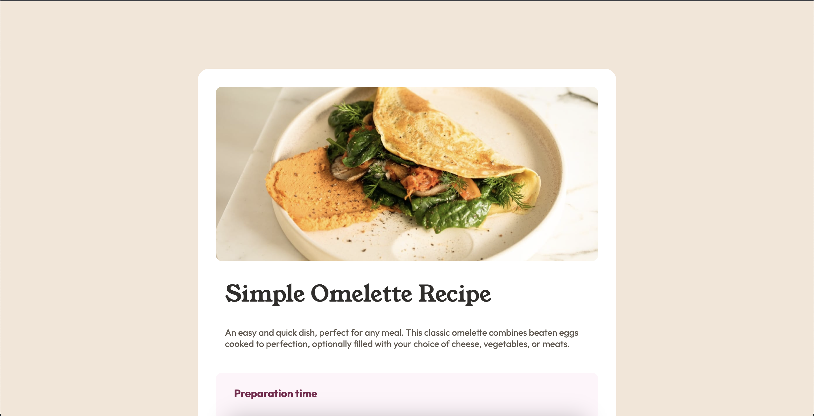
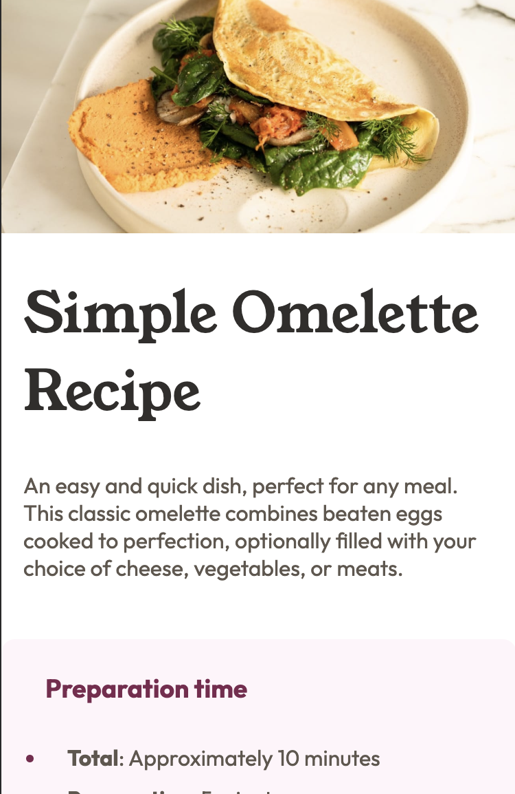

# Frontend Mentor - Recipe page solution

This is a solution to the [Recipe page challenge on Frontend Mentor](https://www.frontendmentor.io/challenges/recipe-page-KiTsR8QQKm). Frontend Mentor challenges help you improve your coding skills by building realistic projects. 

## Table of contents

- [Overview](#overview)
  - [The challenge](#the-challenge)
  - [Screenshot](#screenshot)
  - [Links](#links)
  - [Built with](#built-with)
  - [What I learned](#what-i-learned)
  - [Useful resources](#useful-resources)
- [Author](#author)


## Overview

### Screenshot




### Links

- Solution URL: [Github repo](https://github.com/michaelr47/Recipe-Page)
- Live Site URL: [Add live site URL here](https://your-live-site-url.com)

### Built with

- CSS custom properties
- Flexbox
- Mobile-first workflow

### What I learned

Something I've learned while doing this project was using the css pseudo element '::marker'. I did not know you can style bulletins and numbered lists like that.

Like in this instance here below:

```css
.prepRoseWhite li::marker {
    color: var(--primary-darkRaspberry);
}
```

### Useful resources

- [::marker](https://developer.mozilla.org/en-US/docs/Web/CSS/::marker) - This helped me styled the bulletins and numbered lists.


## Author
- Frontend Mentor - [@yourusername](https://www.frontendmentor.io/profile/michaelr47)